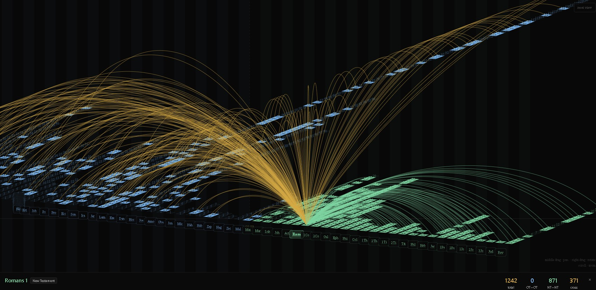

# Scripture Graph



> 341,000 biblical cross-references, visualised as an interactive 3D graph across all 66 books of the Bible.

**[scripturegraph.com](https://scripturegraph.com)**

---

## What is it?

Scripture Graph maps every cross-reference in the Bible as an arc connecting two chapters in 3D space. Each book is laid out along a timeline — Old Testament on the left, New Testament on the right. Arcs curve upward between chapters, coloured by testament relationship:

- 🟡 **Gold** — Old Testament → New Testament connections
- 🔵 **Blue** — Old Testament → Old Testament connections  
- 🟢 **Green** — New Testament → New Testament connections

The result is a living map of how the Bible references itself — prophecy fulfilled, themes echoed, ideas woven across millennia.

---

## Features

- **341,000 cross-references** sourced from community-validated biblical scholarship
- **Interactive 3D canvas** — rotate, pan, zoom with mouse or touch
- **Verse search** — search any verse, book, or chapter
- **Chapter drill-down** — click any chapter square to see all its connections
- **Arc hover** — hover any arc to preview verse pairs with full text
- **Info panel** — full connection list with KJV verse text inline
- **PWA** — installable on iOS and Android, works offline after first load
- **Dark / light mode**
- **Mobile first** — designed for touch, works everywhere

---

## Usage

### Navigation

| Action | Mouse | Touch |
|---|---|---|
| Rotate | Right drag | Single finger drag |
| Pan | Middle drag | — |
| Zoom | Scroll wheel | Pinch |
| Reset | Reset button | Reset button |

### Exploring

1. **Search** — tap the search icon and type a verse (`John 3:16`), book (`Romans`), or chapter (`Genesis 1`)
2. **Click a book label** — highlights all connections for that book
3. **Click a chapter square** — shows all connections for that chapter
4. **Hover an arc** — previews the verse pairs it represents
5. **Click an arc** — loads all pairs into the info panel
6. **Click a verse in the panel** — drills into that verse's own connections

---

### Deep links

Any search automatically updates the URL, making every view shareable. You can also craft links manually using the `?q=` parameter:

| Link | Opens |
|---|---|
| `scripturegraph.com/?q=John+3:16` | John 3:16 and all its connections |
| `scripturegraph.com/?q=Romans+8` | All connections in Romans 8 |
| `scripturegraph.com/?q=Isaiah` | All connections across the book of Isaiah |
| `scripturegraph.com/?q=Genesis+1:1-5` | Connections for Genesis 1:1–5 |

Supported formats: `Book`, `Book Chapter`, `Book Chapter:Verse`, `Book Chapter:Verse-Verse`

---

## Tech Stack

| Layer | Technology |
|---|---|
| Framework | React 19 + Vite 8 |
| State | Zustand |
| Rendering | HTML5 Canvas (2D) |
| Styling | Tailwind CSS v3 |
| Data loading | Web Worker + MessagePack binary |
| PWA | vite-plugin-pwa + Workbox |
| Deployment | Cloudflare Pages |

---

## Architecture
````
src/
├── components/
│   ├── canvas/
│   │   ├── ArcCanvas.jsx        # Main canvas, camera, hit testing
│   │   └── ArcTooltip.jsx       # Arc hover tooltip HTML builder
│   ├── navigation/
│   │   ├── Header.jsx           # App bar
│   │   ├── SearchBar.jsx        # Search bottom sheet
│   │   ├── GraphDropdown.jsx    # Graph type selector
│   │   ├── SourceDropdown.jsx   # Bible version selector
│   │   ├── BottomSheet.jsx      # Shared sheet component
│   │   └── SheetOption.jsx      # Sheet row component
│   ├── ConnectionCard.jsx       # Verse pair card
│   ├── InfoPanel.jsx            # Right/bottom panel
│   ├── EmptyState.jsx           # Empty panel state
│   ├── StatBadge.jsx            # Stats display
│   ├── ScriptureGraphLogo.jsx   # Logo component
│   └── SplashScreen.jsx         # Loading screen
├── store/
│   └── store.js                 # Zustand store + selectors
├── utils/
│   ├── arcGeometry.js           # Arc math, bezier sampling
│   ├── drawScene.js             # Canvas draw functions
│   ├── geometryCache.js         # Typed array geometry cache
│   ├── project.js               # 3D → 2D projection
│   ├── useCamera.js             # Camera state + interactions
│   └── useCanvasSetup.js        # Canvas resize + verse positions
├── data/
│   ├── bookMap.js               # Book metadata, ordering, colours
│   └── useBible.js              # Verse text lookup hook
public/
├── dataWorker.js                # Web Worker — loads + parses binary data
├── data/
│   ├── cross-references.bin     # 341k refs (MessagePack)
│   └── bible-lookup.bin         # KJV verse text (MessagePack)
└── icons/
├── icon.svg                 # PWA icon (dark background)
└── icon-transparent.svg     # Favicon
````
---

## Performance

- **Data parsed off main thread** via Web Worker — no UI blocking on load
- **Binary MessagePack format** — 65% smaller than JSON (~17MB → ~6MB)
- **Geometry cache** — chapter corners and arc bezier samples pre-projected into `Float32Array`, rebuilt only on camera change
- **rAF-batched mouse events** — one mousemove processed per animation frame
- **Zustand selectors** — `maxVotes`, `bookLinkCounts`, `filteredRefs` computed once, never in the draw loop
- **PWA + Workbox** — data files cached with `CacheFirst`, instant on repeat visits

---

## Local Development

```bash
# Clone
git clone https://github.com/gianksp/scripture-graph
cd scripture-graph

# Install
npm install

# Generate binary data files (first time only)
node scripts/convertData.js

# Dev server (exposed to local network for mobile testing)
npm run dev

# Build
npm run build
```

### Mobile testing locally

```bash
npm run dev
# Open http://YOUR_LOCAL_IP:5173 on your phone
# Must be on same WiFi network
```

---

## Deployment

Pushes to `master` automatically deploy to [scripturegraph.com](https://scripturegraph.com) via Cloudflare Pages.

master push → GitHub Actions → Cloudflare Pages → scripturegraph.com

---

## Data Sources

Cross-references sourced from [OpenBible.info](https://www.openbible.info/labs/cross-references/) — a community-curated dataset of 341,000 biblical cross-references with vote counts indicating scholarly consensus.

Bible text: King James Version (KJV) — public domain.

---

## Contributing

Pull requests welcome. For major changes open an issue first.

Areas most open to contribution:
- Additional Bible translations
- Additional graph types (thematic, chronological, geographic)
- Performance improvements
- Accessibility
- Additional features e.g. Export as infographic

---

## License

MIT